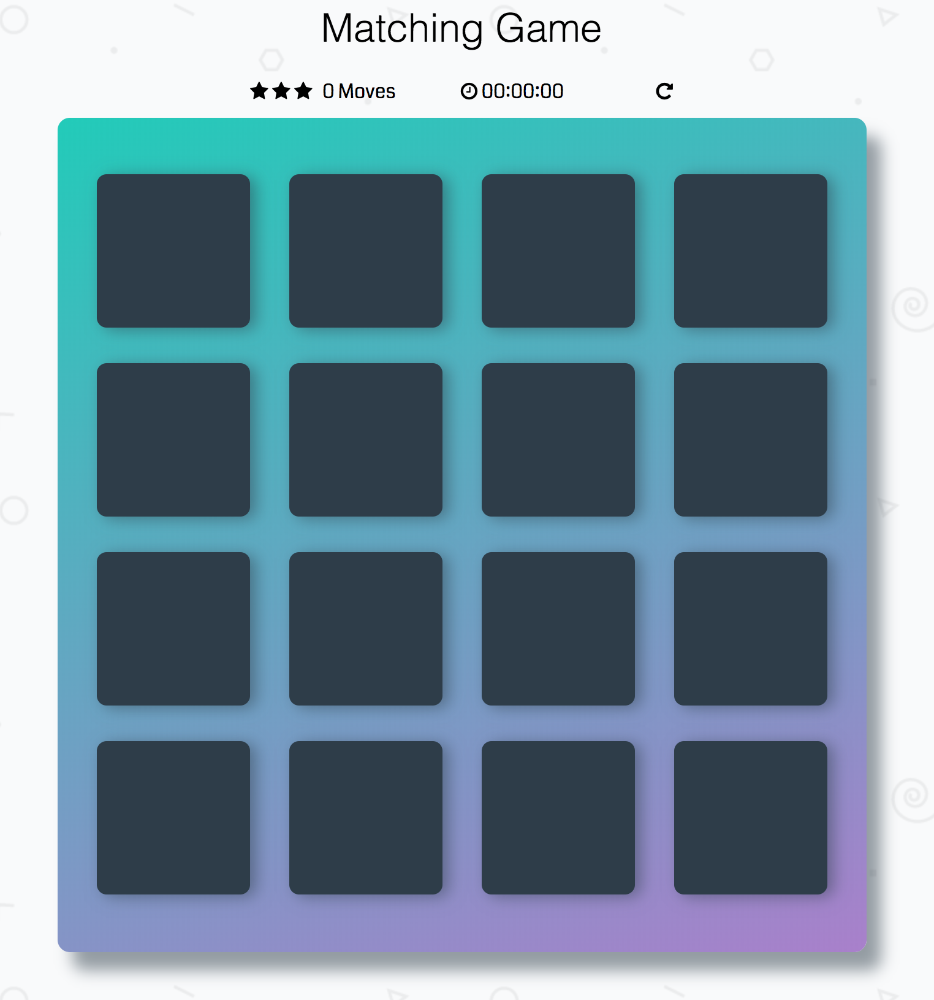
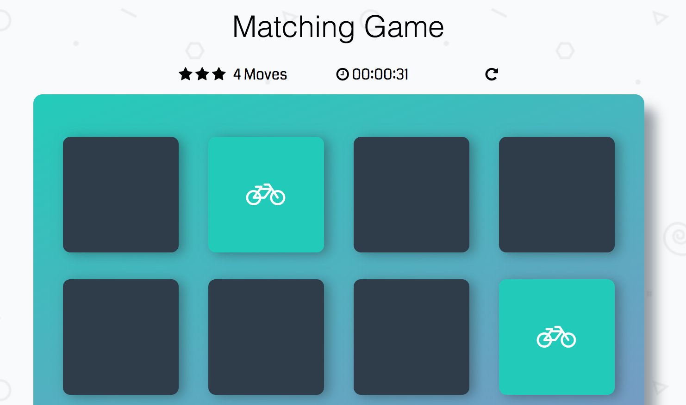
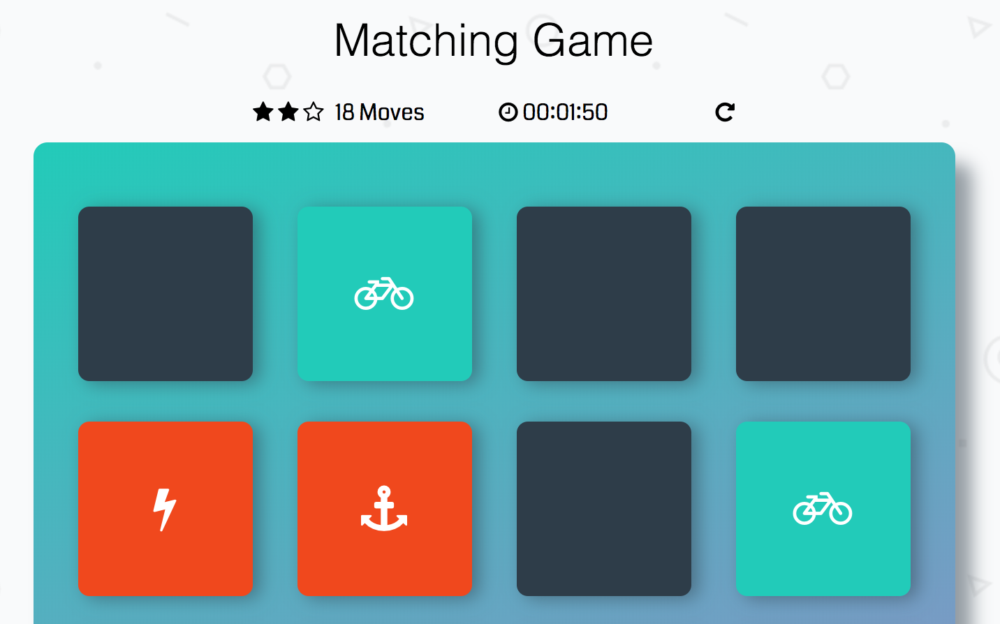
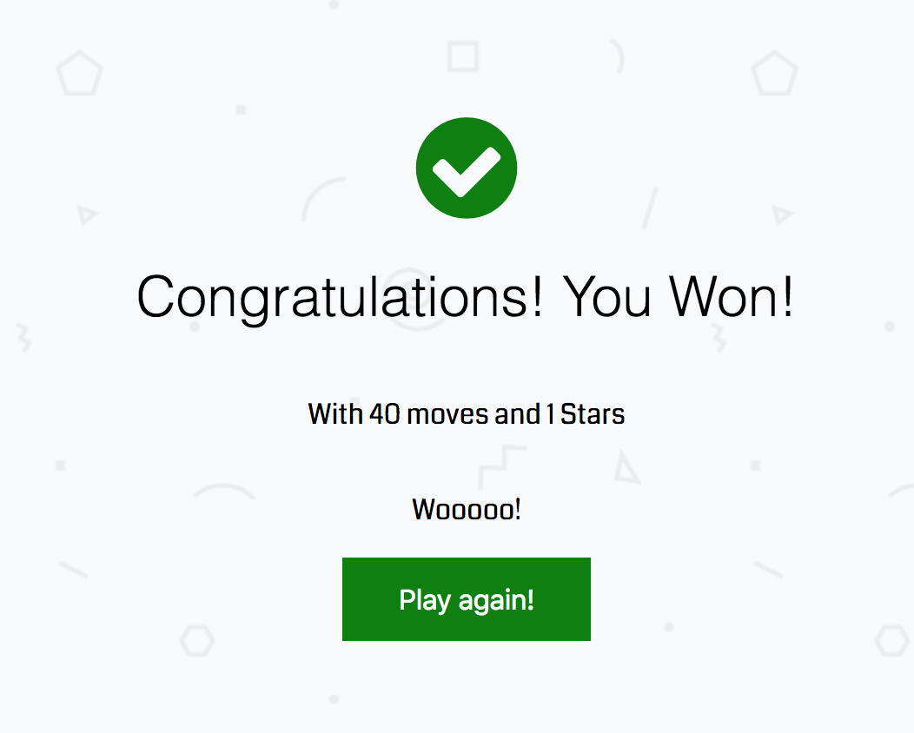

# Memory Game Project

This Project is done as part of Udacity Front end Web developer course. The purpose of the project is to understand the concepts of Javascript and CSS. 

## Table of Contents

* [Instructions](#instructions)
* [How to play](#how-to-play)
* [Screenshots](#screenshots)
* [Contributing](#contributing)

## Instructions

To clone this repository

```
git clone https://github.com/rajashekar/memory-game.git
```

Go to memory-game directory
```
cd memory-game
```

Open `index.html` in any browser (drag and drop index.html in browser)

## How to play

- Click on any card to view card 
- Click on another card to view card
- If both cards are matched, cards will kept open. 
- If both cards are not matched, cards will kept closed. 
- If all 8 pairs are matched game is finished. 
- Stars are reduced for every 16 moves.  
- Timer starts on first move

## Screenshots

### On Start


### On Match


### On Fail


### Finish


## Contributing

This repository is done as part of Udacity Front end Web developer Memoery Game project. Therefore, we most likely will not accept pull requests.

For details, check out [CONTRIBUTING.md](CONTRIBUTING.md).
